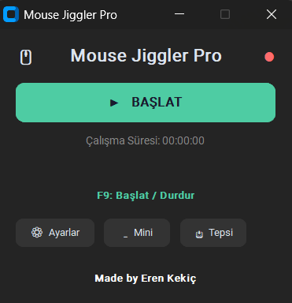
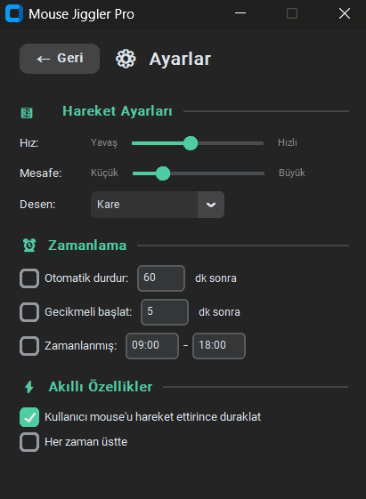

# 🖱️ Mouse Jiggler Pro


<div align="center">

<strong>Windows için modern ve gelişmiş Mouse Jiggler uygulaması</strong>

[](https://www.gnu.org/licenses/gpl-3.0)
[](https://www.python.org/)
[](https://www.microsoft.com/windows)

</div>

---

### 🖼️ Ana Ekran


### ⚙️ Ayarlar Ekranı


---

---

## 📖 Hakkında

Mouse Jiggler Pro, bilgisayarınızın uyku moduna geçmesini veya ekran koruyucunun aktif olmasını engellemek için farenizi otomatik olarak hareket ettiren modern bir Windows uygulamasıdır.

### ✨ Özellikler

| Özellik | Açıklama |
|---------|----------|
| 🎨 **Modern Arayüz** | CustomTkinter ile karanlık tema |
| 🔄 **3 Hareket Deseni** | Rastgele, Dairesel, Kare |
| ⏱️ **Zamanlama Seçenekleri** | Otomatik durdurma, gecikmeli başlatma, zamanlanmış çalışma |
| ⏸️ **Akıllı Duraklatma** | Kullanıcı mouse'u hareket ettirince otomatik duraklatma |
| 🗕 **Mini Mod** | Kompakt görünüm |
| 📥 **System Tray** | Arka planda çalışma |
| ⌨️ **Klavye Kısayolu** | F9 ile hızlı başlat/durdur |
| 💾 **Ayar Kaydetme** | Tüm ayarlar otomatik kaydedilir |

---

## 🚀 Kurulum

### Yöntem 1: Kolay Başlatma (Önerilen)

1. **Python 3.8+** yüklü olmalıdır ([Python İndir](https://www.python.org/downloads/))
   > Kurulum sırasında **"Add Python to PATH"** seçeneğini işaretleyin!

2. Projeyi indirin veya klonlayın:
   ```bash
   git clone https://github.com/ErnKe/mouse-jiggler-pro.git
   ```

3. `run.bat` dosyasına çift tıklayın - **Hepsi bu kadar!**
   > İlk çalıştırmada gerekli kütüphaneler otomatik yüklenir.

### Yöntem 2: Manuel Kurulum

1. Projeyi indirin
2. Gerekli kütüphaneleri yükleyin:
   ```bash
   pip install -r requirements.txt
   ```
3. Uygulamayı başlatın:
   ```bash
   python mouse_jiggler.py
   ```

---

## 📦 Gereksinimler

### Zorunlu
- **Python 3.8+**
- **customtkinter** - Modern UI framework

### Opsiyonel (Ekstra özellikler için)
- **pystray** + **Pillow** - System tray desteği
- **keyboard** - F9 klavye kısayolu

Tüm bağımlılıklar `requirements.txt` dosyasında listelenmiştir.

---

## 🎮 Kullanım

### Temel Kullanım

1. **BAŞLAT** butonuna tıklayın veya **F9** tuşuna basın
2. Mouse otomatik olarak hareket etmeye başlayacak
3. Durdurmak için **DURDUR** veya tekrar **F9**

### Ayarlar

⚙️ **Ayarlar** butonuna tıklayarak şunları özelleştirebilirsiniz:

#### 🎛️ Hareket Ayarları
- **Hız**: Hareket sıklığını ayarlayın (yavaş ↔ hızlı)
- **Mesafe**: Hareket mesafesini ayarlayın (küçük ↔ büyük)
- **Desen**: Rastgele, Dairesel veya Kare

#### ⏰ Zamanlama
- **Otomatik Durdurma**: Belirli bir süre sonra otomatik durdurma
- **Gecikmeli Başlatma**: Belirli bir süre sonra başlama
- **Zamanlanmış Çalışma**: Belirli saatler arasında otomatik çalışma

#### ⚡ Akıllı Özellikler
- **Kullanıcı Algılama**: Mouse'unuzu hareket ettirdiğinizde otomatik duraklatma
- **Her Zaman Üstte**: Pencereyi her zaman üstte tutma

### Mini Mod

🗕 **Mini** butonuyla kompakt moda geçin - sadece başlat/durdur butonu ve durum göstergesi.

### System Tray

📥 **Tepsi** butonuyla uygulamayı sistem tepsisine küçültün. Sağ tıklayarak:
- Göster
- Başlat/Durdur
- Çıkış

---

## ⌨️ Klavye Kısayolları

| Kısayol | İşlev |
|---------|-------|
| **F9** | Başlat / Durdur |

> Not: Klavye kısayolu için `keyboard` kütüphanesi gereklidir.

---

## 📁 Dosya Yapısı

```
mouse-jiggler-pro/
├── mouse_jiggler.py      # Ana uygulama
├── requirements.txt      # Python bağımlılıkları
├── run.bat               # Başlatma scripti
├── run.bat               # Başlatma scripti
├── README.md             # Bu dosya
├── LICENSE               # GPL-3.0 Lisansı
└── screenshots/          # Ekran görüntüleri
    └── screenshot.png
```

---

## 🔧 Ayar Dosyası

Ayarlarınız otomatik olarak şu konumda saklanır:
```
%USERPROFILE%\.mouse_jiggler_settings.json
```

---

## 🐛 Sorun Giderme

### "Python bulunamadı" hatası
- Python'un yüklü olduğundan emin olun
- Python'u PATH'e eklediğinizden emin olun

### Klavye kısayolu çalışmıyor
```bash
pip install keyboard
```

### System tray çalışmıyor
```bash
pip install pystray pillow
```

---

## 📄 Lisans

Bu proje **GNU Genel Kamu Lisansı v3.0** altında lisanslanmıştır. Detaylar için [LICENSE](LICENSE) dosyasına bakın.

---

## 👨‍💻 Geliştirici

**Eren Kekiç**

---

<div align="center">

**Made by Eren Kekiç**

</div>
